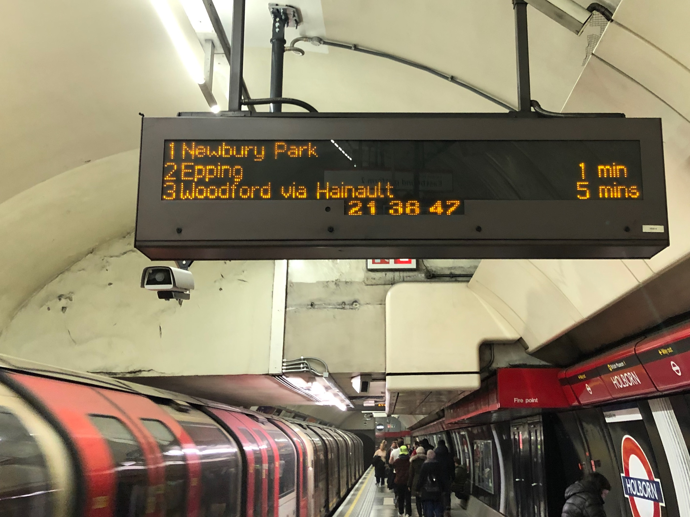
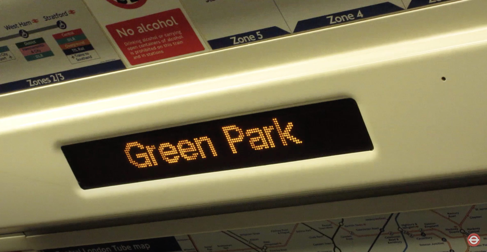

# London TFL Dot Matrix Typeface

A set of dot matrix fonts in the style of TFL's Underground network. Each font weight represents a unique typeface featured on TFL arrivals boards and rolling stock led announcement boards.

## London Underground Regular

This typeface sets out to recreate the font used on dot matrix arrival boards found across London Underground stations in late-2019 / early-2020.

### Character Set Details
This font includes a full alpha character set (upper and lower cases), numbers, and symbols `- ' & * +`.

## London Underground Medium

This typeface sets out to recreate the dot matrix font found displayed on London Underground 1996 Stock.

### Character Set Details
This font includes a full alpha character set (upper and lower cases) and symbols `! ' , - . : ;`.

**NOTE: Unverified Characters!** This font currently includes 'best effort' characters due to a lack of reference materials for certain letters. Please contact me on [Twitter](https://twitter.com/petykowski_) if you have photographs of these characters.
* `F J K Qq U V X Y Z`

## London Underground Bold

### Character Set Details
This font only includes a full number set and symbols `:`.

## London Underground Heavy

This typeface sets out to recreate the font used on dot matrix arrival boards found across London DLR stations in late-2019 / early-2020.

### Character Set Details
This font includes a full alpha character set (upper and lower cases), numbers, and symbols `- ' , * ()`.

## Reference

London Underground Regular, Bold, and Heavy is sourced from original photographs of dot matrix arrival boards found across London Underground stations during late-2019 / early-2020.

The following photographs are an example of the particular dot matrix style which was referenced in the typeface creation.

London Underground Medium is sourced from video recordings found on YouTube. Attributes as follows:
* [Tony - Transit & Games](https://www.youtube.com/channel/UCgeEbnxA5A2M30JRgfLiYMw)
* [X2K9](https://www.youtube.com/watch?v=MpcsaVmps-Q)
* [Random Transport](https://www.youtube.com/watch?v=1G5eaNuZYDc)

## Contribute

#### Build Additional Characters to Existing Typeface
From Adobe Illustrator template file:
1. Build New Character
   - Add new artboard
   - Provide name of character for layer and artboard
   - Build character on separate layer
2. File > Export > Export As...
2. Export Artboards as SVG
   - Choose Export location
   - Format: SVG (svg)
   - Use Artboards Checked
   - All Artboards Selected
   - Maintain default SVG options

#### Add Characters to Existing Typeface
Open .sdf file in FontForge
1. Select character to update
2. File > Import
3. Set width to width of character + 100
   - If svg width is 600 then set element width to 700

#### Generate Font
1. File > Generate Fonts
   - Maintain default export values
2. Save into `font` directory of repo 

## License

This typeface is distributed with an [SIL Open Font License](http://scripts.sil.org/OFL).